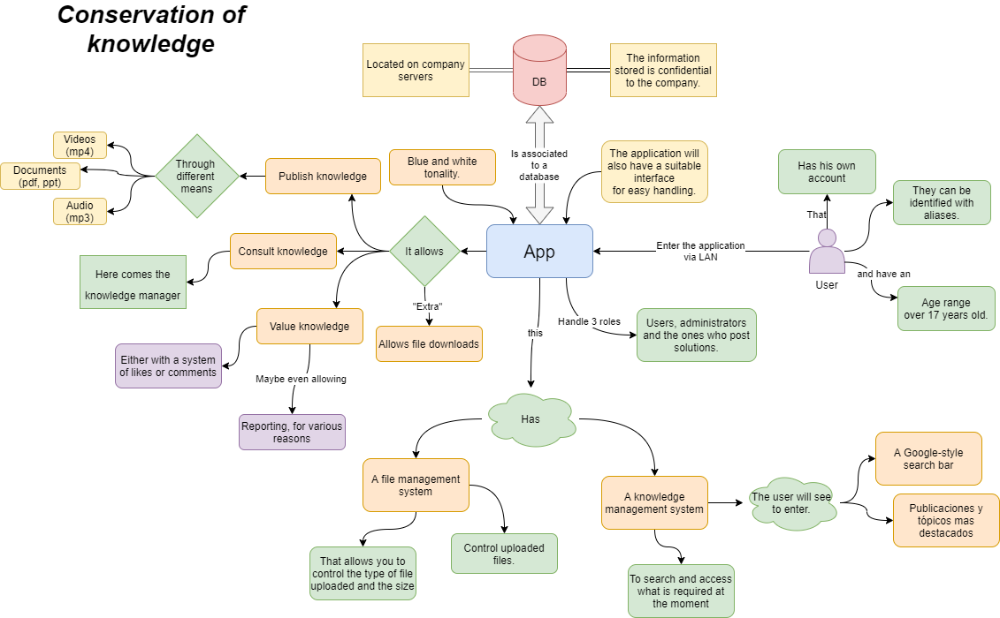
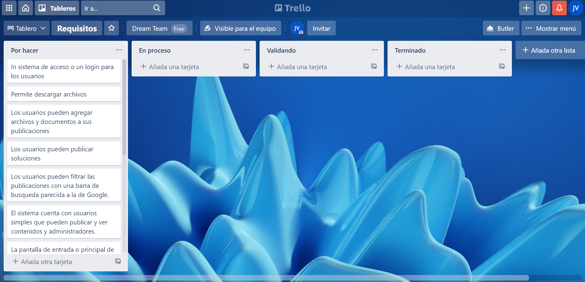
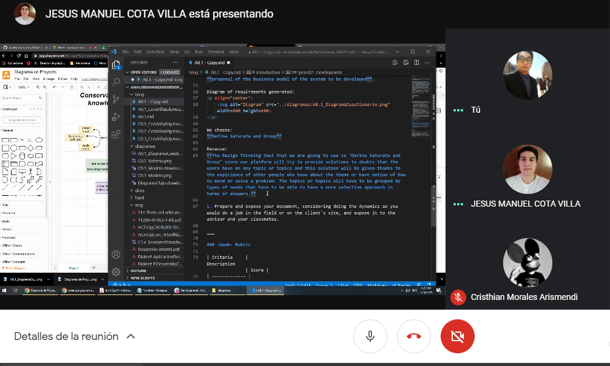
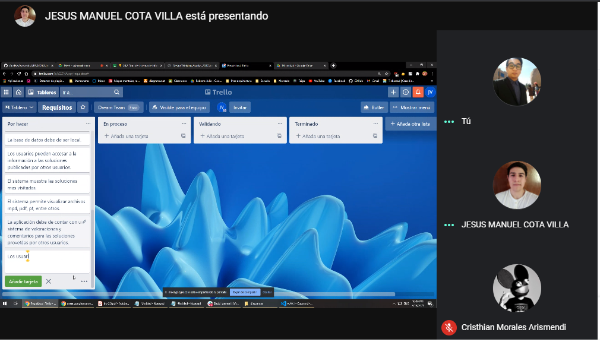

# Introduction

## :trophy: A0.1 Learning activity

## Objetive

Carry out the context of the case study, as well as a field interview, and finally consolidate the information of the requirements, using the empathize phase proposed by design thinking.

### :blue_book: Instructions

- Based on the information provided by the advisor on the topic of design thinking, empathize phase, carry out the activity indicated in the development section, and if necessary, carry out a brief investigation about **tools to collect information for the analysis of customer requirements**.
- Any activity or challenge must be done using the style **MarkDown with extension .md** and the VSCode development environment, having to be prepared as a document **single page**, that means, if the document has images, links or any external document, it must be accessed from tags and links, and it must be named with the nomenclature **A0.1_NameOfActivity_NameOfStudent.pdf.**
- It is a requirement that the .MD contains a tag of the link to the repository of your document in GITHUB, for example **Link to my GitHub** and at the end of the challenge it should be uploaded to github.
- From the **.md** file export a **.pdf** file that must be uploaded to classroom within its corresponding section, serving as evidence of its delivery, since being the ** official ** platform, it will be received here the rating of your activity.
- Considering that the .PDF file, which was obtained from the .MD file, both must be identical.
- Your repository in addition to having a **readme**.md file in your root directory, with information such as student data, work team, subject, career, adviser's data, and even logo or images, it must have a section of contents or index, which are really links or 
**links to your .md documents**, _avoid using text_ to indicate internal or external links.
- Is proposed a structure  as indicated below, however any other that supports you can be used to organize your repository.

```
| readme.md
| | blog
| | | Cx.1_NameoftheActivity.md
| | | Ax.1_NameoftheActivity.md
| | diagrams
| | docs
| | html
| | img
| | pdf    
```

___

## :pencil2:  Development

1. Taking as a basis the characteristics referred to in the case study and the design thinking proposal, elaborate context, a list of at least **15 questions directed to the client**, such that they can give you more detailed information to elaborate the analysis of the requirements on the case study.

   1. How would you expect users to access the system? (R)
   2. What steps would you expect from the general user when using the application? (R)
   3. Where will users access the system from? (local/remota) (R)
   4. What types of users do you expect the system to include? (E)
   5. How sensitive / confidential would the information be stored by the system? (E)
   6. Would you like access levels to be managed to access the information? (E)
   7. Would you expect it to be aimed at users who found how to solve their problems? (E)
   8.  In your company, how old are the employees who would use the application in general? (R)
   9.  At which users will the data analytics be shown to? (R)
   10. Approximately how many active users will be operating the system at any given time? (R)
   11. Are users expected to be able to download files? (R)
   12. Would you like user accounts to be in control of the company? (E)
   13. What colors do you expect the application to include in its interface? (E)
   14. What do you think of the implementation of user profile photos? (R)
   15. Is there a file standard that you would like to handle within the application? (R)

2. Once the interview indicated in the previous point has been carried out, use any of the techniques proposed within the empathize phase of design thinking, and you can even use any other tool, technique or artifact to consolidate the information collected through the client and elaborate your **proposal of the business model of the system to be developed**.

Diagram generated:
<p align="center">
    
</p>


We choose:
**Define Saturate and Group**

Because:
**The Design Thinking tool that we are going to use is "Define Saturate and Group" since our platform will try to provide solutions to doubts that the users have on any topic or topics and this solution will be given thanks to the expirience of other people who know about the theme or have notion of how to mend or solve a problem. The topics or topics will have to be grouped by types of needs that have to be able to have a more selective approach in terms of answers.**

Trello:
<p align="center">
    
</p>

1. Prepare and expose your document, considering doing the dynamics as you would do a job in the field or on the client's site, and expose it to the advisor and your classmates.

# ***Conclusions***

## ***Cota Villa Edy Jesus Manuel***
Through the interview we conducted in this activity, we were able to extract new requirements for the development of our project, where we can apply tools that are used to solidify the points that must be covered in the system, it is interesting the existence of tinking design tools that allow to the developers of an application to better understand the points and objectives that an application should have and the different points of view that they offer.

## ***Jaramillo Regino Hector Armando***
In this activity we made an improvement to what was our diagram of the last activity, only we implemented some improvements based on the interview carried out in class, it was also interesting to work with design thinking and it was easy to choose the right one for our project, in general It was a very enriching experience which allowed me to experience what an interview is like in the work environment.

## **Evidencia de Reunion**


<p align="center">
    
</p>

<p align="center">
    
</p>
___

### :bomb: Rubric

| Criteria     | Description                                                                                  | Score |
| ------------- | -------------------------------------------------------------------------------------------- | ------- |
| Instructions | Is each of the points indicated in the Instructions section fulfilled?            | 10      |  | 5 |
| Development    | Was each one of the points requested within the development of the activity answered?     | 60      |
| Demonstration  | Does the student introduce himself during the explanation of the functionality of the activity?            | 20      |
| Conclusions  | Is a personal opinion of the activity included by each of the team members? | 10      |

### :bookmark: Links

**Cota Villa Edy Jesus Manuel**

:school: [Repositorio](https://github.com/HectorJaramillo/Analisis-Avanzado-de-Software)
:memo: [Actividad](https://github.com/CotaVilla/Sistemas-Programables/blob/master/docs/A5.1_EdyCota_DreamTeam.md)

**Jaramillo Regino Hector Armando**

:school: [Repositorio](https://github.com/HectorJaramillo/JaramilloHector-SistemasProgramables)
:memo: [Actividad](https://github.com/HectorJaramillo/Analisis-Avanzado-de-Software/blob/main/Blog/A0.1_Recopilaci%C3%B3n%20de%20datos%20por%20medio%20de%20la%20entrevista_HectorJaramillo.md)

