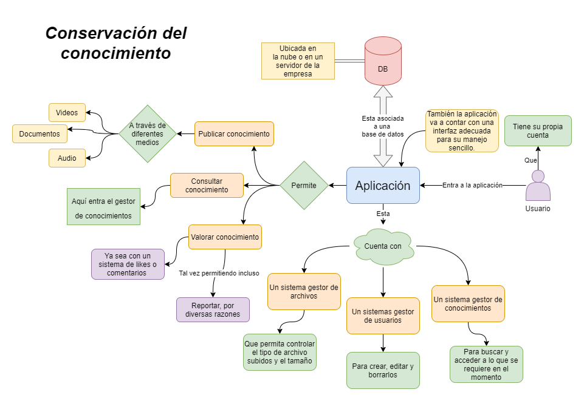

# Tipo de Sistema de información

## :trophy: C0.2 Reto en clase

Investigación sobre el tipo de sistema que involucra el caso de estudio a desarrollar

___

## Instrucciones

- Realizar una investigación sobre el tipo de sistema que se habrá de desarrollar, respondiendo a las preguntas que se plantean en la sesión de desarrollo.
- Puede apoyarse de la herramienta Draw.io para elaborar los diagramas o ilustraciones que se solicitan o considere necesario.
- Toda actividad o reto se deberá realizar utilizando el estilo **MarkDown con extension .md** y el entorno de desarrollo VSCode, debiendo ser elaborado como un documento **single page**, es decir si el documento cuanta con imágenes, enlaces o cualquier documento externo debe ser accedido desde etiquetas y enlaces.
- Es requisito que el archivo .md contenga una etiqueta del enlace al repositorio de su documento en Github, por ejemplo **Enlace a mi GitHub**
- Al concluir el reto el reto se deberá subir a github el archivo .md creado.
- Desde el archivo **.md** se debe exportar un archivo **.pdf** con la nomenclatura **C0.2_NombredelaActividad_NombreAlumno.pdf**, el cual deberá subirse a classroom dentro de su apartado correspondiente, para que sirva como evidencia de su entrega; siendo esta plataforma **oficial** aquí se recibirá la calificación de su actividad por individual.
- Considerando que el archivo .pdf, fue obtenido desde archivo .md, ambos deben ser idénticos y mostrar el mismo contenido.
- Su repositorio ademas de que debe contar con un archivo **readme**.md dentro de su directorio raíz, con la información como datos del estudiante, equipo de trabajo, materia, carrera, datos del asesor, e incluso logotipo o imágenes, debe tener un apartado de contenidos o indice, los cuales realmente son ligas o **enlaces a sus documentos .md**, _evite utilizar texto_ para indicar enlaces internos o externo.
- Se propone una estructura tal como esta indicada abajo, sin embargo puede utilizarse cualquier otra que le apoye para organizar su repositorio.

```
| readme.md
| | blog
| | | Cx.1_NombredelaActividad.md
| | | Ax.1_NombredelaActividad.md
| | diagrams
| | docs
| | html
| | img
| | pdf    
```
___

## :pencil2:  Desarrollo

1. Apoyado de la información mostrada por el asesor, realice una investigación, donde se pueda dar respuesta a los siguientes puntos:

  - Identifique a que tipo de sistema esta referido el caso de estudio y porque cae en esta categoría.

Considero que es un **Sistemas de administración del conocimiento**

**Ya que:**
Porque se prevee como una herramienta que se utiliza para conservar el conicimiento dentro de una empresa o compañia, siendo los conocimientos aquiridos por los empleados ante su estadia a partir de videos, imagenes y texto que estara anexada a diferentes medios de conocimientos, para evitar que esos conocimientos se pierdan cuando el empleado sale de la empresa.

**Y toca los puntos clave de:**
- Que permitira reutilizar del valor añadido que una organización genera y adquiere en la experiencia de trabajadores.
- Da acceso unificado a todas y cada una de las capas de información tejidas sobre la estructura organizacional.

:globe_with_meridians:[Fuente 1](https://freshdesk.com/latam/knowledge-management-system/#:~:text=Un%20sistema%20de%20gesti%C3%B3n%20del%20conocimiento%20es%20una%20herramienta%20que,para%20clientes%20internos%20y%20externos.)
:globe_with_meridians:[Fuente 2](https://www.gestiopolis.com/sistemas-gestion-conocimiento/)
  
  - Describa las características que debe tener el caso de estudio para cumplir con el tipo de sistema.

    1. La aplicacion permitira el almacenaje de informacion, guias, imagenes y videos.
    2. Aumenta la capacidad de retener informacion o mas bien la capacidad intelectual generada por los trabajadores de la empresa.
    3. Permite a los trabajadores a acceder a la informacion.
    4. Reduce el tiempo y costo de aprendizaje y/o capacitacion de los usuarios.
    5. Permite a los usuarios contribuir a la valoracion de los recursos vistos.

  - Una vez que se cuenta con los conceptos de los puntos anteriores, elabore una ilustración que explique el flujo de interacción del sistema y sus componentes que lo habrán de integrar (vistas gráficas, controladores, Base de datos,..) para el caso de estudio.

<p align="center">
    
</p>

  - Explique en clase su investigación.
___

### :bomb: Rubrica

| Criterios     | Descripción                                                                                  | Puntaje |
| ------------- | -------------------------------------------------------------------------------------------- | ------- |
| Instrucciones | Se cumple con cada uno de los puntos indicados dentro del apartado Instrucciones?            | 20 |
| Desarrollo    | Se respondió a cada uno de los puntos solicitados dentro del desarrollo de la actividad?     | 80      |
   
:book: [Ir a mi actividad ](https://github.com/CotaVilla/AnalisisAvanzadoDeSoftware_Feb21-Jul21/blob/main/blog/C0.2_CotaVillaEdyJesusManuel.md)

:house: [Ir a mi repositorio ](https://github.com/CotaVilla/AnalisisAvanzadoDeSoftware_Feb21-Jul21)